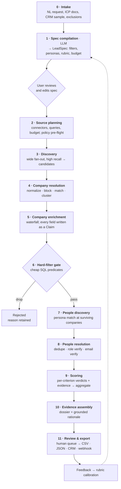

# LeadMoor — Architecture Proposal

**Status:** Proposal (pre-implementation). No code written yet.
**Date:** 2026-08-20
**Scope:** A standalone AI lead-generation product. Shares no code, data, or runtime with MOOR.

---

## 1. What we are building

A user writes a request in plain language:

> "Series B–C fintech companies in the UK and Netherlands, 50–300 employees, that have
> shipped something with AI in the last six months and are hiring backend engineers.
> I want the VP Engineering or Head of Platform. Skip anyone already in our CRM."

The system returns a scored lead list where **every claim is backed by a citation** — a
URL, a fetch timestamp, and the exact snippet the claim came from. The user can open any
lead and see precisely why it scored the way it did, and what the system did *not* know.

That last part is the product. Lead databases are a commodity; defensible, auditable
*reasoning over evidence* is not.

## 1a. Decided scope for M0

Four questions were settled before implementation. They do not change the architecture — every
component below survives — but they sharply narrow what gets built first. Consequences are
detailed in [§15](#15-decisions-and-what-they-change).

| Decision | Choice |
|---|---|
| Geography | **US-only for M0** |
| Data strategy | **Web-first, open registries as the identity spine** |
| Output shape | **Tens of leads, deep dossiers** |
| Name | **LeadMoor retained** |

---

## 2. The three design commitments

Everything below follows from three decisions. If we hold these, the product works. If we
relax any of them, we ship a plausible-sounding hallucination machine.

### 2.1 The model never authors a fact

The LLM is allowed to do exactly three things:

1. **Compile** the natural-language request into a typed specification.
2. **Propose** queries — what to search, where to look next.
3. **Judge** supplied evidence against a criterion, citing the spans it used.

It is never asked "which companies match this?" and never permitted to emit a company
name, a headcount, a funding round, or an email address from its own weights. Every
factual field on every record arrives from a retrieval connector and carries provenance.

A verdict that cites evidence which does not exist, or quotes a span that is not present
in the cited document, is **rejected by a validator** and the criterion is marked
`insufficient_evidence`. It fails closed. An unknown is always reported as an unknown and
never silently scored as a zero.

### 2.2 Two planes: a non-deterministic planner over a deterministic substrate

```
Natural language  ──▶  LeadSpec (typed IR)  ──▶  deterministic pipeline  ──▶  results
                 LLM                        no LLM in the control flow
```

The LLM's output is a **LeadSpec**: a versioned, typed, human-readable document
describing filters, personas, scoring rubric, and budget. The user sees it and can edit it
before a penny is spent. Execution is then an ordinary deterministic data pipeline.

This buys us: reproducible runs, replayable audits, cost ceilings that actually hold, a
debuggable failure surface, and cheap re-runs when the user tweaks one weight.

### 2.3 Permission is enforced at runtime, not documented in a policy

Every connector ships a **manifest** declaring its legal basis, jurisdiction, permitted
field classes, robots posture, rate limits, retention TTL, and redistribution rights. A
policy engine evaluates that manifest at three gates: before fetch, after extraction, and
at export. "Permitted public data" is a code path, not a promise.

## 3. Pipeline



The shape that matters is the **funnel**. Discovery is wide and cheap. The hard-filter gate
at stage 6 runs before people discovery, because people discovery and email verification
are the expensive operations. Spending Opus tokens on a company that fails a headcount
filter is the single easiest way to make this product uneconomic.

### Stage notes

| # | Stage | What it does | Cost profile |
|---|-------|--------------|--------------|
| 0 | Intake | Capture request, attachments, CRM export, suppression list | free |
| 1 | Spec compilation | LLM → typed `LeadSpec`; bounded clarifying questions (max 3) | 1 Opus call |
| 2 | Source planning | Map spec → connector plan + query strings; policy pre-flight | 1 Sonnet call |
| 3 | Discovery | Parallel fan-out; high recall, low precision | API + search units |
| 4 | Company resolution | Deterministic ER: normalize → block → pairwise → cluster | CPU only |
| 5 | Company enrichment | Waterfall across providers, cheapest-first, stop on hit | API units |
| 6 | Hard-filter gate | SQL predicates from spec; drop with retained reason | free |
| 7 | People discovery | Persona-matched contacts at survivors only | API units |
| 8 | People resolution | Dedupe, verify role, verify email deliverability | API units |
| 9 | Scoring | Structured predicates free; LLM judges only for fuzzy criteria | Sonnet × leads |
| 10 | Evidence assembly | Dossier + grounded "why this lead" narrative | Sonnet × leads |
| 11 | Review & export | Human queue, then export with provenance attached | free |

## 4. Anti-hallucination machinery

This is the part most competitors get wrong, so it gets its own section.

**Claims, not fields.** A company record is not a row of values. It is a set of claims:

```
Claim {
  entity_ref, field, value,
  evidence_id, extractor, confidence, observed_at
}
```

The "current" value of a field is a *view* computed by survivorship rules
(source trust tier × recency × corroboration count), not a stored truth. Two sources
disagreeing produces a `conflict` record that surfaces in the UI rather than a silent
overwrite.

**Citation validation.** Every LLM verdict must return `evidence_ids[]` and quoted spans.
A validator checks that each ID exists in this run and that each quoted span appears in
that evidence's extracted text (exact match, then normalized fuzzy match). Failures are
not retried into compliance — they are marked `insufficient_evidence` and excluded from
the score.

**Content-addressed snapshots.** Every fetch is stored in object storage keyed by SHA-256
of its body, with URL, HTTP status, robots decision, and fetch time. A score from three
months ago can be re-audited against exactly the bytes that produced it. This is also what
makes GDPR "tell them where you got it" answerable per-lead.

**Confidence decay.** Evidence has a half-life that varies by field class. Headcount from a
14-month-old page is not the same claim as headcount from last week, and the score should
know that.

**Coverage, reported.** Each lead carries a coverage percentage: how many rubric criteria
were actually evaluable. A lead scoring 82% on 4 of 9 criteria is a different object from
one scoring 82% on 9 of 9, and the UI must never conflate them.

## 5. Scoring

The rubric is compiled from the request into individually-evaluable criteria:

```
Criterion {
  id, name,
  kind: hard_filter | weighted | bonus | disqualifier,
  weight,
  evaluator: structured_predicate | numeric_range | llm_judge,
  evidence_requirement
}
```

- **Hard filters and numeric ranges** run as SQL. Free, exact, no model involved.
- **LLM judges** handle only genuinely fuzzy criteria — "sells into regulated healthcare",
  "has invested in AI recently". Each returns `{verdict, confidence, evidence_ids, quoted_spans, rationale}`.
- **Aggregation is deterministic arithmetic** over criterion verdicts. The model does not
  emit "87/100". A model that scores holistically cannot be tuned, audited, or explained.

Because aggregation is separate from judgment, user feedback (accept / reject / "wrong
persona") tunes **weights**, not prompts. The explanations stay stable while the ranking
improves.

**Cost lever:** the rubric is identical across every lead in a run. Put it in a cached
prompt prefix and the per-lead marginal cost collapses. This is the difference between
$0.04 and $0.004 per lead evaluation at volume, and it is the reason a rubric/lead split
beats an all-in-one agent prompt.

## 6. Entity resolution

The failure mode here is merging two genuinely different companies, which is worse than
leaving a duplicate. Merges are conservative and **always reversible** — clusters are
recorded as links, never as destructive overwrites.

**Companies.** The identity spine is the registered domain, but a domain alone is not
enough (rebrands, regional domains, holding structures, acquisitions). Identifier ladder:

1. Strong: LEI, SEC CIK, Companies House number, verified primary domain
2. Medium: normalized legal name + country, canonical redirect target, social handles
3. Weak: trading name, embedding similarity of description

Blocking on normalized name tokens + domain root + country keeps pairwise comparison
tractable; `pgvector` similarity catches the cases token blocking misses. Ambiguous pairs
(score in the uncertainty band) go to a human review queue rather than auto-merging.

**People.** `(canonical_company_id, normalized_name)` plus verified work email as a strong
key. Job changes mean person records are bitemporal — we track when a role was observed,
not just what it is.

**Suppression and CRM dedup** are hash-based, so a customer's existing contacts can be
excluded without us storing their CRM in the clear.

## 7. Data sources — tiered by permission posture

Tiers reflect legal risk, and the policy engine enforces them. Current case law supports
this ordering: `hiQ v. LinkedIn` established that scraping public pages does not violate
the CFAA, and `Meta v. Bright Data` (2024) declined to block **logged-out** scraping of
public pages on the reasoning that platform terms bind account holders, not logged-out
visitors. `Reddit v. Perplexity` (2025) moved the risk to a different question —
**circumvention of technical access controls** under DMCA §1201. So the line we draw is
not "public vs. private" but "logged-out and un-circumvented vs. anything else."

| Tier | Category | Examples | Posture |
|------|----------|----------|---------|
| **A** | Licensed APIs *(none in M0)* | People Data Labs, Coresignal, Apollo, Crunchbase, Crustdata | Contractual permission. **Read redistribution terms before building the connector** — several prohibit derivative databases or re-export, which directly constrains what we may put in a CSV. |
| **B** | Open registries & government data | **M0:** SEC EDGAR, GLEIF (LEI, CC0), USPTO, SAM.gov. *Later:* UK Companies House, EU business registers | Explicitly open. Highest trust tier for survivorship. Cheap. Start here. |
| **C** | Official search APIs + logged-out first-party fetch | **M0:** Exa or Brave Search API; company sites, team and careers pages, press releases, GitHub | Permitted with robots.txt respect, rate limiting, honest user-agent, no login, no anti-bot circumvention. |
| **D** | **Excluded by policy** | Logged-in social scraping, anti-bot circumvention, CAPTCHA solving, consumer data brokers, scraped datasets of unknown provenance, personal mobile/home addresses | Blocked in code. No connector may be registered in this tier. |

Tier D is not a warning — the policy engine has no code path that permits it.

## 8. Compliance as a subsystem

GDPR permits B2B prospecting under **legitimate interest** rather than opt-in, but
conditions attach, and each one maps to a concrete component:

| Requirement | Component |
|---|---|
| Message relevant to their professional role | Persona + rubric are role-scoped by construction |
| Transparency about where data came from | Provenance travels with every exported lead |
| Easy opt-out, honored before next send | Suppression service, hash-keyed, checked at export |
| Documented legal basis per record | Source manifest recorded on every claim |
| Retention limits (~3 years without interaction) | TTL per source; automated purge job |
| Data subject access / erasure | DSAR endpoint over the claim store |
| Demonstrable compliance | Append-only audit log per run and per fetch |

**Data minimization is a default, not a setting.** Business-context fields only: work
email, title, employer, public professional profile. Personal mobile numbers and home
addresses are not collected — they are the fields that turn a B2B tool into a
Clearview-shaped liability.

**EU AI Act:** B2B lead scoring is not an Annex III high-risk use case, so the high-risk
regime does not attach (and that deadline has in any case been deferred to December 2027
by Regulation (EU) 2026/1744). Article 50 transparency obligations remain live on the
original schedule and apply where AI-generated content reaches a person — relevant if we
later add outreach drafting. A model card plus human review in the loop keeps us clean.

Because enforcement is real (cumulative GDPR fines passed €7.1B by January 2026), these
are build-time requirements, not a later hardening pass.

## 9. Core data model

```
tenant, user

lead_request      raw NL + attachments
lead_spec         versioned typed IR (JSON), user-editable
run               spec_version, status, budget, metrics

source            registry: legal basis, rights, limits, trust tier
fetch             url, source, status, robots_decision, ts, cost
evidence          sha256, storage_uri, url, fetched_at, extracted_text_ref, license

company           canonical
company_identifier domain | LEI | CIK | CH# | ticker
company_alias
person            canonical, bitemporal roles
person_identifier email_hash | profile_url

claim             entity_ref, field, value, evidence_id, confidence, observed_at
conflict          competing claims + survivorship decision
entity_link       candidate → canonical, match_score, method, decided_by

criterion_verdict run, entity, criterion, verdict, confidence, evidence_ids[], rationale
lead              run, company, person, score, band, coverage, status

export, suppression, dsar_request, audit_log, feedback
```

`claim` is the table the whole product hangs off. If it is right, evidence, scoring,
conflict resolution, DSAR, and audit all fall out of it. If it is wrong — if we store flat
mutable fields on `company` — none of the rest can be retrofitted.

## 10. Ports

Connectors are plugins behind stable interfaces, each shipping a policy manifest. Adding a
source becomes a config + adapter change, never a pipeline change.

```
DiscoveryConnector   discover(spec, budget) → CandidateStream
EnrichmentConnector  enrich(entity, fields) → Claim[]
SearchProvider       search(query) → SearchResult[]
Fetcher              fetch(url, policy) → Evidence
Resolver             resolve(candidates) → Cluster[]
Scorer               score(entity, rubric, evidence) → CriterionVerdict[]
Exporter             export(leads, format) → Artifact
PolicyEngine         check(action, context) → Allow | Deny(reason)
RunEngine            durable orchestration
LLMClient            structured output, prompt caching, cost metering
```

## 11. Technology recommendation

| Concern | Choice | Why |
|---|---|---|
| Language | TypeScript, pnpm workspaces | One language across API, workers, UI; Zod gives us the typed `LeadSpec` contract end to end |
| Datastore | PostgreSQL + `pgvector` | Claims, ER, and semantic blocking in one store; no premature vector DB |
| Evidence store | S3 / R2, content-addressed | Immutable snapshots, cheap, auditable |
| Orchestration | Durable execution behind a `RunEngine` port — start with Inngest | Runs take minutes to hours across flaky third-party APIs and pause for human review. Retries, resumability, and long timers are not optional. Migrate to Temporal if per-run step counts or self-hosting demand it |
| Models | Claude, tiered: Opus for spec compilation and hard adjudication, Sonnet for per-lead judging, Haiku for normalization | Cost tracks the funnel; prompt-cache the rubric prefix |
| Frontend | Next.js | Spec editor, run monitor, review queue, dossier view |

Two notes on this table. **Durable execution is the one piece that is painful to retrofit**
— a lead run is a long-lived saga with human-in-the-loop signals and partial failure, and
bolting that onto a request/response service later means rewriting the pipeline. Start with
it. And the **ER-in-TypeScript** call is a judgment: if match quality plateaus, a Python
worker using Splink behind the `Resolver` port is the escape hatch, which is exactly why
`Resolver` is a port.

### Repository layout

```
leadmoor/
  apps/     api · web · worker
  packages/ core · policy · connectors · resolution · scoring
            evidence · llm · export · db
  infra/
  docs/adr/
```

## 12. Separation from MOOR

The requirement is structural, and right now it is free: `spartanapparelbiz-ui/leadmoor`
is an empty repository with zero commits, and no MOOR source is present in this
environment. There is nothing to disentangle — only something to prevent.

**Enforced by:**

- Separate repository, database, object storage bucket, secrets, and deployment.
- Separate authentication. No shared identity provider, no shared session.
- A CI dependency check that fails the build on any import resolving to a MOOR package.
- Any future integration goes over the public HTTP API and webhooks — the same contract a
  third party would use. No shared libraries, ever.
- ADR-0001 records this as a binding decision rather than a convention.

**One flag:** the name. "LeadMoor" reads as a MOOR sub-product. If this needs to stand
alone as a brand — separately positioned, separately sold, or separately owned — the name
works against that, and a repository rename costs nothing today and gets expensive after
the first customer, the first domain, and the first contract.

## 13. Delivery phases

| Phase | Goal | Done when |
|---|---|---|
| **M0** | Walking skeleton, evidence chain proven end to end | One US request → 20–50 leads with named people, full rubric coverage, and every field traceable to a stored document. Tier B + C only. Suppression and deletion live |
| **M1** | Quality | Real ER with review queue, waterfall enrichment, people discovery, email verification, dossier UI |
| **M2** | Compliance hardening | Policy engine at all three gates, suppression, DSAR, retention purge, audit log |
| **M3** | Learning | Feedback → weight calibration, signal/trigger sources, CRM push, scheduled monitoring runs |
| **M4** | Scale | Multi-tenant isolation, cost optimization, connector SDK |

M0 deliberately proves the *hardest* thing first — that a claim can be traced from an
exported CSV cell back to a byte range in a stored document. Every later phase assumes it.

## 14. Risks

| Risk | Severity | Mitigation |
|---|---|---|
| Provider ToS forbids derivative databases or re-export | **High** — can invalidate the export feature | Read every contract before writing its connector; encode rights in the manifest; export gate enforces per-field |
| Hallucinated leads destroy trust permanently | **High** | Citation validator, fail-closed, coverage always visible |
| LLM cost per lead × thousands of leads | **High** | Funnel ordering, prompt caching, model tiering, hard budget governor that stops the run |
| Bad merges in entity resolution | Medium | Conservative thresholds, uncertainty band → human review, reversible links |
| Email verification gaps damaging sender reputation | Medium | Verify before export, no catch-all pattern guessing by default, suppression enforced |
| Users expecting instant results | Medium | Runs are async with streaming partial results, not request/response |
| Vendor lock-in on data providers | Low | Every provider sits behind a port; waterfall design assumes substitution |

## 15. Decisions and what they change

### US-only for M0

**Sources become:** SEC EDGAR (full-text search and submissions), GLEIF LEI records (CC0),
USPTO, SAM.gov, plus Tier C search and first-party fetch. UK Companies House and the EU
registers drop out of M0 and return whenever geography expands.

**Compliance gets lighter, not absent.** CAN-SPAM replaces GDPR as the governing outreach
regime, and the full legitimate-interest documentation apparatus can wait for M2. But roughly
twenty US state privacy laws are in force by 2026, and while most carry a "publicly available
information" exemption that covers much of what Tier B and Tier C return, **deletion rights
still attach** — and inferences we generate are ours, not exempt public record.

So the M0 compliance cut is:

- **Keep in M0:** suppression service, provenance on every claim, and a deletion endpoint over
  the claim store. Once claims exist these are nearly free, and each one is expensive to
  retrofit.
- **Defer to M2:** automated retention purge, per-jurisdiction legal-basis records, the full
  DSAR workflow with identity verification.

### Web-first, registries as the identity spine

No Tier A connector ships in M0. Two consequences follow, and the second is the one that
matters.

**Entity resolution carries more weight.** Without a provider handing us canonical IDs, the
identifier ladder in §6 *is* the resolution strategy. SEC CIK and GLEIF LEI become the strong
keys; verified primary domain does the rest. This is workable — it is also why `Resolver` is a
port with a Splink escape hatch.

**Contact discovery is the genuinely hard part.** Web-first company discovery is well-trodden.
Web-first *people* discovery is not. The honest sources are company team and about pages, press
releases, SEC filings (officers and directors), conference speaker lists, job postings, GitHub,
and patents (inventors). Names and roles are reachable this way. **Verified work email often is
not.**

The recommended M0 posture, given we have already ruled out catch-all pattern guessing:

> A lead is company + named person + role evidence. Work email is a best-effort field, marked
> `unverified` when it cannot be confirmed, and never fabricated from a pattern.

If that proves too thin in practice, the narrow fix is a **single Tier A connector used only for
email resolution**, sitting behind `EnrichmentConnector` like any other. That is a swappable
dependency on one field, not an abandonment of the web-first stance — and it is a decision worth
making with M0 evidence in hand rather than now.

### Tens of leads, deep dossiers

This is the choice that best fits the evidence differentiator, and it relaxes the cost pressure
that shaped §5.

- **Model tier moves up.** At tens of leads per run, Opus for per-lead criterion judging is
  affordable and better. Sonnet becomes the fallback rather than the default.
- **Corroboration becomes a requirement, not a nicety.** Any criterion driving a
  disqualification requires **two independent sources**. At this volume we can afford it, and a
  wrongly-disqualified lead is invisible to the user unless we surface it.
- **Full rubric coverage per lead** is the target, with the coverage figure from §4 expected
  near 100% rather than merely reported.
- **The review queue is central**, not an M1 nicety — a human sees every lead at this volume.

**What M0 therefore does not need:** bulk export tooling, aggressive prompt-cache optimization,
the connector SDK, multi-tenant isolation, and the elaborate budget governor. A simple hard
ceiling per run suffices.

### LeadMoor retained

No action. Technical separation stands on its own via ADR-0001, and the concern is recorded
there should positioning change later.

### Revised M0 definition of done

One real US request produces twenty to fifty leads, each with a named person, role evidence,
full rubric coverage, and a dossier in which **every field traces to a stored document and a
byte range**. Suppression and deletion work. Nothing in the run touched a Tier D source, because
no such code path exists.

---

## Sources consulted

- [Is Web Scraping Legal in 2026? hiQ, Meta v Bright Data, Reddit v Perplexity](https://www.coronium.io/blog/is-web-scraping-legal-2026)
- [Is Web Scraping Legal in 2026? hiQ, Bright Data, GDPR & AI Act](https://use-apify.com/docs/what-is-apify/is-apify-legal)
- [GDPR & B2B Prospecting: The Complete Compliance Guide 2026](https://derrick-app.com/gdpr-b2b)
- [GDPR Legitimate Interest for Cold Email in 2026](https://litemail.ai/blog/gdpr-legitimate-interest-cold-email-2026)
- [EU AI Act Omnibus Agreement — Postponed High-Risk Deadlines](https://www.gibsondunn.com/eu-ai-act-omnibus-agreement-postponed-high-risk-deadlines-and-other-key-changes/)
- [Yes, August 2 Still Matters: High-Risk AI Delay, Transparency Obligations Remain](https://www.joneswalker.com/en/insights/blogs/ai-law-blog/yes-august-2-still-matters-the-eu-approved-a-high-risk-ai-delay-but-most-trans.html)
- [Best B2B Data APIs in 2026 for Sales and Marketing](https://coldiq.com/blog/best-b2b-data-apis)
- [10 Best B2B Data Providers 2026 — Clay](https://www.clay.com/guides/best/b2b-data-providers)
